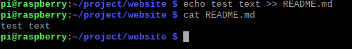

<h1>Building a boilerplate using bash</h1>

<h3>First things first!</h3>
start a terminal in your linux distro.
display "Hello terminal!" message in the terminal
 
<code>$ echo [something]</code> is used to display [something] in the terminal 

<h2>Working with Project directory</h2>
<h3>1. Find your working directory</h3>
When you're working with projects you need to know what directory you are in!
 
So, <code>pwd</code> is used to find out your working directory
  
<h3>2. Making a directory and moving in</h3>
You need to make a new directory for your project
Make directory called [project] and move into it
 
<code>$ mkdir [dirname]</code> - to make directory
 
<code>cd [dirname]</code> - to move in directory you in 
  

<h3>3. List</h3>
List the contents of the folder
 
<code>ls</code> - is used to display contents
  

<h3>4. Make a directory</h3>
Make a new directory for your website (dirname="website")
 
<code>$ mkdir [dirname]</code> 
  

<h3>5. List contents</h3>
List contents of project folder but make it more verbose.
 
<code>$ ls</code>
 
All comands have flags, you can see the list of all
attributes in the manual page or help
 
<code>$ man [command name]</code>
 
<code>$ [command name] --help</code>
 
<code>$ ls</code> accept two flags: -a and -l flag. -l flag used to display everything like list and more verbose. 
 

<h2>Working with website directory</h2>
<h3>1. Go to website directory</h3>
<code>cd [dirname]</code>
  
<h3>2. List the contents</h3>
Try to do it yourself. I will not be near you everytime.
  
<h3>3. Display the message</h3>
<code>echo [message]</code> 
  Display message "Hello website!" in terminal
  
<h3>4. Create a new file</h3>
Usually there is some index.html file inside website folder if making a real deal, so, please make some file
index.html  
<code>$ touch [filename.file_extension]</code> is used to create new files.
  
<h3>5. Styles.css</h3>
Also, there is some styles.css file. Could you make it, please?
<code>touch [filename.file_extension]</code> 
  
<h3>6. List contents</h3>
You know what to do, but also make the output verbose in list format
  
<h3>7. Index.js file</h3>
Usually for frontend development we use javascript. So, for our script files we need index.js file. Can you make it?
  
<h3>8. gitignore?</h3>
When working in team and with real apps we usually use Git version control system. But some files sometimes should be ignored, so there is such file as .gitignore. Can you please make it, in case we will turn this in Git repository?(remember to put dot just before gitignore!)
  
<h3>9. List again</h3>
Yeah, please, list the contents one more time.
  
<h3>10. Where's .gitignore?!</h3>
Some files are hidden, so how are we supposed to see them? Well, use the help flag to find it out. 
<code>$ ls --help</code>
  
<h3>10. --all or -a?</h3>
So, we need -a flag or --all flag if we want to type everything. List everything now, so you can find out where's .gitignore
<code>ls -a</code>
  
<h3>12. Dots??</h3>
Also, you can see some dots here. One dot "." means current directory (we need it when starting scripts or just to let computer better now what we mean) and two dots ".." - previous directory. So, go back, to the previous folder using:  
<code>$ cd ..</code>
  
<h3>13. Background</h3>
Your website is not full without some background. So, let's just create one for educational purposes (in real situation it's more likely that you'll have one real background picture). Use touch command to create background.jpg
  
<h3>14. Header and body image, and remember about font!</h3>
Also, we need some header.jpeg and body.jpg. And we need font file, let's create font.otf 
  
<h3>15. List!</h3>
Once again, pls, list the contents
  
<h3>16. Images folder...</h3>
Oh, no... Well.... We actually forgot that we need a special folder for images. Create a folder with name images.
  
<h3>17. List</h3>
You know what to do, man
  
<h3>18. Let's do a copy</h3>
Well, we should have background.jpg in images folder but we missing it there. Let's copy it. 
<code>$ cp [file_to_copy] [destination_folder]</code>
  
<h3>19. Check the copy</h3>
Let's head in images folder and check out if background.jpg there or not (psss, you need to list the contents). If everything ok, return back to the website folder
  
<h3>20. DELETE!</h3>
We don't need background.jpg in website folder anymore. Let's delete it 
<code>$ rm [file_to_delete]</code> is used to delete files
  
<h3>21. Moving instead of copying</h3>
Well, we can copy header.jpeg but we will need to delete it... to many things to do, so let's do moving instead! You need to move header.jpeg to images folder. 
<code>$ mv [file_to_move] [folder_to_move_into]</code>
  
<h3>22. Now it's body turn</h3>
Move body.jpg to image folder
  
<h3>23. Oh...</h3>
Well, uno problemo... we don't need image for body. We need image for main-section. Actually, body.jpg image is ok for our main-section but we need to call it more suitable. So, let's rename it! (remember to <code>cd</code> to the images folder first) 
<code>$ mv [file_to_rename] [new_name_for_file]</code> - Yeah, forgot to tell you, <code>mv</code> can also be used as renaming command.
  
<h3>24. List</h3>
One list command in images folder, pls. Just to check that everything is fine.
  
<h3>25. Tree</h3>
Nature is a great thing and programmers think so too. But we actually like trees most... especially if they are inside our computers. So, let's see the directory tree. Go back to website folder and there summon a tree. 
<code>$ cd ..</code> 
<code>$ find</code> - is used to make a directory tree
  
<h3>26. No fonts folder</h3>
Poor us! We forgot to make fonts folder, make one, pls.
  
<h3>27. Moving again</h3>
Move font.otf to fonts folder, pls.
  
<h3>28. We need a new tree</h3>
We need to see if everything is right. So, using find command make a new website directory tree.
  
<h3>29. Remember about clients!</h3>
We should also make a directory for our clients information and client side files. Make a client folder, pls
  
<h3>30. Source folder</h3>
Well, now it's time to move index.html to another folder. First, make new folder called src in client (client/src). Then, move index.html there (client/src/index.htmk)
  
<h3>31. Tree</h3>
Make a tree to be sure that everything is fine
  
<h3>32. index.js and styles.css also</h3>
Now, move index.js and styles.css to src folder (client/src/index.js) (client/src/styles.css)
  
<h3>33. Find subbfolder</h3>
So, be sure that you're in website folder now. Check it with <code>pwd</code> command. So, now let's find src folder from website. Use find to find subfolder and it's contents 
<code>$ find ./client/</code>
  
<h3>34. What's find can also do?</h3>
Use --help flag with find command to learn it out.
  
<h3>35. Names of files</h3>
So, find can find something using <code>-name</code> flag. Let's try it to find index.html
<code>$ find -name index.html</code> (be sure that you're in website folder)
  
<h3>36. Hide-n-seek with styles.css</h3>
Try to find styles.css by yourself
  
<h3>37. Assets</h3>
Go to client folder and make a new one there. Call it assets. Then, make images folder inside assets folder (client/assets/images)
  
<h3>38. Moving out</h3>
Now go to the website folder, find images folder and move there. Now you need to <code>mv</code> all the files to client/assets/images.  
<code>$ mv ./* ../client/assets/images/</code>
  
<h3>39. Now delete something for me</h3>
Delete the directory images that is in website
<code>$ rmdir [folder_to_delete]</code>
  
<h2>Now a big deal</h2>
<h3>First</h3>
So, during all these steps, we managed to do something. Let me just give you a task, so you'll complete it all and once. 
Well, make icons folder in client/assets/ folder 
Go to icons folder and create a new file called icon.ico 
Now go back to assets and make a tree and check that contents of your assets folder is the same 
 
  
<h3>Second</h3>
Now let us end this. Head to website folder. Here you need to create two files: package.json and server.js. 
After that, pls, create a README.md file 
Now let's edit it a bit. we can use editor, but we need to learn terminal first. 
Add next sentence to README.md file: Now, i know how to build website-boilerplates! 
To complete it, use next command <code>$ echo [text] >> [file]</code> - this command will allow you to write [text] in your [file]
 
Now, let us see if everything is right. To make the output of file in terminal use <code>$ cat [file]</code> command 
if you have output like 
 
Then it's fine 
 
Now, add some new lines but using vim/nano editor.
<code>$ vim (or nano) [filename]</code>
 
Add lines about yourself: Name, date of birth and hobby for example.
 
Now, exit vim or nano, and use <code>more [filename]</code> command to view contents of README.md
 

 
Now, use find command to make a tree and make sure you have something like: 

 
If everything is alright, then, congratulations, you've made it! Now, you know some basic commands of linux and know how to make boilerplates! 